# First Mate Home: design spec

Design reference as of **October 3, 2026**. It describes what First Mate Home looks like and how it behaves, for porting to the Mac app. It covers design only (layout, sizes, colors, states, motion and copy) and says nothing about how to build it.

- **Reference page (interactive):** [reference.html](./reference.html). Use the Moment switch to see Morning, Afternoon, All clear and Something broke.
- **Stylesheet:** [first-mate-home.css](./first-mate-home.css) holds every value the reference page renders, in one file.
- **Markup and states:** [first-mate-home.js](./first-mate-home.js) builds each part; [moments.js](./moments.js) holds the copy for each moment.
- **Folder:** `design/first-mate-home-2026-10-03/` in the herdr-companion checkout (not committed).

When this spec and the reference page disagree on looks, the reference page wins. Ask the designer about intent. All data is synthetic.

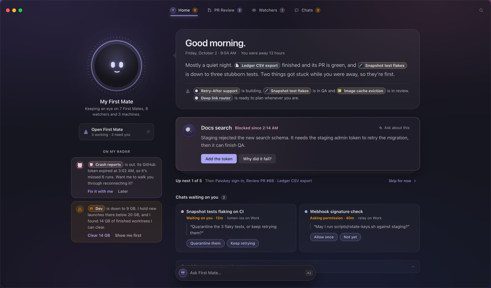

## 1. What Home is

Home is the first thing you see when you open Herdr. It is not a dashboard. My First Mate greets you, tells you in a few plain sentences how your work is going, shows **one thing to do at a time**, lists the chats waiting on you, and mentions what it noticed ("On my radar"). PR Review, Watchers and Chats are one click away in the tab bar.

Principles:

1. **Snapshot first, chat on the side.** The page is a calm snapshot. Talking to First Mate happens in a small chat that pulls up from the bottom and can move to the full First Mate window.
2. **One focus at a time.** A single card is in front, and the next ones are stacked behind it.
3. **First Mate speaks.** The summary, the radar notes and the confirmations are written in First Mate's voice, with smart chips inside sentences instead of counts and panels.
4. **Proactive when quiet.** When nothing needs you, Home offers ideas instead of saying "all clear".
5. **Seamless window.** There is no toolbar band and no divider. The window controls, tabs and search float over Home.

## 2. Window and top strip

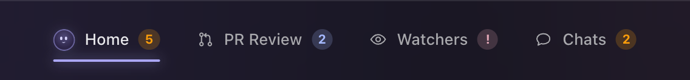

| Part | Spec |
|---|---|
| Window | Corner radius 12. Dusk glass: `rgba(21,21,25,.80)` with 30pt blur (saturation 115%) over the dusk gradient. 1pt border white 10%. Shadow 0 30 80 black 55%. Dark only. |
| Top strip | 64pt tall and laid **over** the content. No background, no border and no divider line. |
| Strip on scroll | Once content has scrolled more than 6pt under it, a soft backdrop fades in over 0.2s: a vertical gradient from `rgba(23,22,30,.95)` at the top (solid to 50%) to transparent. |
| Window controls | Standard traffic lights, 18pt from the left edge, vertically centred in the strip. |
| Tab bar | Centred horizontally on the **window** (not the content area) and vertically in the strip. See section 3. |
| Search | Icon button only: 32×32pt, radius 9, 16pt magnifier in `--icon`, 14pt from the right edge. Clicking it or pressing ⌘F turns it into a 230pt search field (28pt tall, radius 6, white 4% fill, white 10% border, accent border when focused). Esc, or leaving it empty and clicking away, turns it back into the icon. |
| No other controls | There is no "First Mate" toolbar button. It lives under First Mate's face (section 5). |

## 3. Tab bar

Four places, in this order: **Home · PR Review · Watchers · Chats**. Shortcuts ⌘1–⌘4.

| Part | Spec |
|---|---|
| Tab | 38pt tall, horizontal padding 14pt, radius 10, 2pt between tabs. Icon 15pt, 8pt gap, label 13pt medium. |
| Icons | Home: First Mate's face at 18pt (it shows the current mood, and is 70% opacity when Home isn't the current tab). PR Review: pull request. Watchers: eye. Chats: speech bubble. |
| Colors | Resting: `--ink-2`. Hover: `--ink` with a white 5% fill. Current: `--ink`. |
| Current marker | 2pt underline, inset 14pt from the tab's sides, 1pt above the tab's bottom edge. Radius 2, `--accent`, with a glow of 0 0 10 accent at 70%. |
| Count | A pill after the label, only when there's something to count. 17pt tall, min 17pt wide, radius 9, 10.5pt bold. The text is the tone color on a 20% fill of the same tone. |
| Tooltip | The place's status line plus its shortcut, e.g. "#1291, #1284 waiting on you · ⌘2". |

Counts:

| Tab | Shows | Tone |
|---|---|---|
| Home | Number of focus cards (section 6). Hidden in All clear, where the cards are ideas. | Attention `#FF9F0A` |
| PR Review | Reviews waiting on you, including GitHub requests that haven't been prepared yet. | Brand blue `#A6BAFF`, or Alert `#E2A7B6` if one couldn't be prepared |
| Watchers | "!" when any watcher needs a look | Alert `#E2A7B6` |
| Chats | Chats waiting on you | Attention `#FF9F0A` |

## 4. Home layout

| Part | Spec |
|---|---|
| Scroll area | The whole window below the top strip scrolls; the strip stays on top. |
| Grid | Two columns, centred: **First Mate column 290pt**, gap 44pt, **content column up to 780pt**. |
| Padding | 92pt top (clears the strip), 40pt sides, 116pt bottom (clears the Ask bar). |
| First Mate column | Centred contents. It scrolls with the page. |
| Content column, top to bottom | Summary balloon → focus card stack → stack navigation → Chats waiting on you → While you were away. |
| Narrower windows (≤ 1360pt) | First Mate column 250pt, gap 32pt, 28pt side padding. Top and bottom padding stay the same. |

## 5. First Mate column

### 5.1 The face

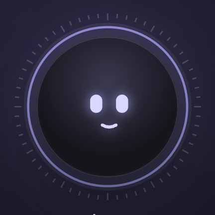 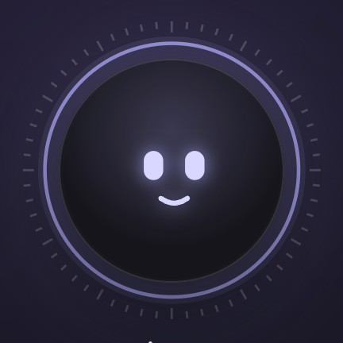 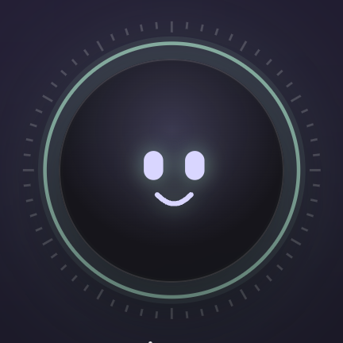 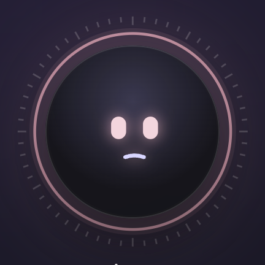 

*Moods left to right: attentive, calm, happy, concerned, thinking.*

This is the same face as the First Mate HUD core, at 168pt.

| Part | Spec |
|---|---|
| Frame | 168×168pt. The ring artwork extends 12% beyond the frame on every side (about 208pt in total) and doesn't affect layout. |
| Disc | Inset 8% (about 141pt across). Fill `rgba(21,21,25,.86)` with a soft accent highlight, `rgba(170,166,244,.24)`, centred at 50% / 32% and fading out by 62%. 1pt inner hairline white 13%. Shadow 0 18 40 black 45%, plus a glow of 0 0 80 in the ring color at 28%. |
| Face | Square, 52% of the disc. Two rounded-rectangle eyes, 8×12 units with radius 4 (24-unit half-width), and one stroked mouth (2.1 units, round caps). Eye and mouth color `#D9D6FF`, with an accent glow (drop shadow 6pt, accent 85%). |
| Ring | Outer ring at 46/60 of the ring radius, stroke 1.3 units, ring color at 80%. Glow ring at 44/60, 9 units wide, 10% opacity. **60 tick marks** between 50 (51.5 for minor) and 54 units: every 5th is long, white 20%. The ticks turn once every 120s and stay centred on the face. |

Moods (ring color, eyes and mouth):

| Mood | When | Ring | Mouth |
|---|---|---|---|
| Attentive | Things need you (Morning) | Accent `#AAA6F4` | Small smile, `M-4.5 10 q4.5 2.6 9 0` |
| Calm | Afternoon, normal | Accent | Smile, `M-5.5 9.5 q5.5 4 11 0` |
| Happy | All clear, or after you clear the list | Signal `#9CCDB9` | Wide smile, `M-7 8 q7 7.5 14 0` |
| Concerned | Something broke, while machine problems are open | Alert `#E2A7B6`, eyes tinted `#F3D5DD` | Slight frown, `M-5 11.6 q5 -1.8 10 0` |
| Thinking | While First Mate works on an answer | Current ring color, plus two spinning arcs | Flat line, 7 units |

Motion: blinks every 5.2s, floats ±3pt over 6s, and the eyes drift toward the pointer (up to 2.6 units sideways and 2 units vertically, fully at 420pt away). While thinking, the eyes glance side to side (±2.4 units over 1.5s) and two dashed arcs spin outside the ring: dash 60/22/14/22 at 1.6s, and dash 5/10 in reverse at 2.6s and 60% opacity. When First Mate says something, the mouth "talks" (vertical scale 0.5↔1.7 every 0.19s) for 1.3s. **Clicking the face opens the chat** (section 9).

### 5.2 Name, status and the First Mate button

| Part | Spec |
|---|---|
| Name | "My First Mate", 17pt semibold display, tracking −0.01em, 16pt below the face. |
| Status line | 12.5pt/1.45, `--ink-2`, max width 250pt: "Keeping an eye on 7 First Mates, 8 watchers and 3 machines." |
| **Open First Mate** | A card 16pt below the status line, 240pt wide. Padding 9/12/9/13, radius 12, white 4% fill, white 10% border. A 16pt sailboat in accent, a title ("Open First Mate", 13pt semibold) over a status line (11.5pt `--ink-2`, e.g. "3 working · 3 need you"), and a 12pt "opens elsewhere" arrow in `--icon`. Hover: accent-wash fill and accent-line border. It opens the First Mate window. |

### 5.3 On my radar

Proactive notes from First Mate: things it noticed, usually with an offer to act.

| Part | Spec |
|---|---|
| Label | "ON MY RADAR", 11pt semibold, uppercase, tracking 0.06em, `--ink-2`, centred, 24pt below the First Mate button. |
| Note | Full column width, 10pt apart. Radius 16, padding 12/14. Fill: tone at 6% over white 2%. Border: tone at 20%. Two columns: 26pt leading mark, 12pt gap, text. |
| Leading mark | The watcher's critter avatar at 26pt when the note is about a watcher; otherwise a 26pt circle with an icon in the tone color at 15% (alert triangle, eye for info, sparkles for good news). |
| Text | 12.5pt/1.6 `--prose`, with smart chips inline. |
| Actions | Text buttons 7pt below, 12.5pt semibold, 16pt apart. The first is accent; the others `--ink-2`. |
| Tones | Alert (something is out or failing), Attention (a resource is running low), Info `#A6BAFF` (First Mate handled something for you), Good `#9CCDB9` (good news, no action). |

### 5.4 First Mate's reply bubble

When you act on a card with the chat closed, First Mate confirms in a bubble beside its face. The same line is also added to the chat.

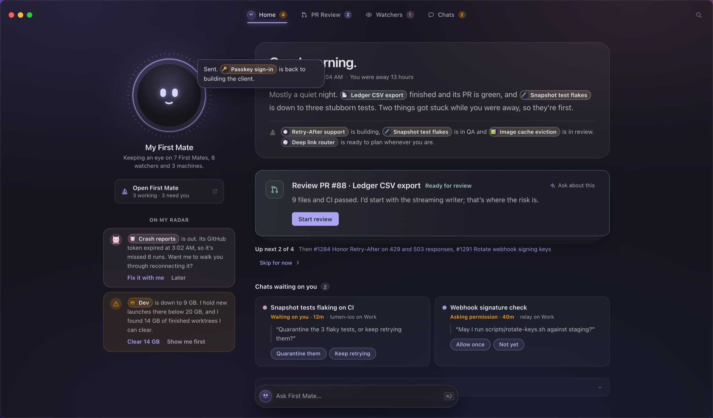

Placement: overlapping the face's top-right, from 22pt inside its right edge and 4pt from its top. Size: 280pt wide. Shape: radius 4/16/16/16, so the pointy corner is toward the face. Fill `rgba(38,36,50,.98)`, accent-line border, shadow 0 16 36 black 45%. Text: 13pt/1.55 `--ink`, with chips. It pops in over 0.25s (rising 4pt and growing from 97%) and disappears after 4.2s.

## 6. Summary balloon

| Part | Spec |
|---|---|
| Balloon | Radius 24, padding 26/30/22. White 5% fill, white 10% border. |
| Tail | A small triangle on the left edge pointing at First Mate: 11pt wide, 20pt tall, 74pt from the top, white 9%. |
| Greeting | 30pt semibold display, tracking −0.022em. Changes with the moment (section 11). |
| Date line | 7pt below, 12.5pt `--ink-2`: "Friday, October 2 · 9:04 AM · You were away 13 hours". |
| Summary | 14pt below, 16.5pt/1.8 `--prose`. Two or three sentences, with chips at 12.5pt. |
| Also moving | One line under a hairline (14pt above, 12pt padding): a 15pt sailboat in `--icon`, then 13pt/1.8 text listing what's moving, e.g. "Retry-After support is building, Snapshot test flakes is in QA…". |

## 7. Focus card stack

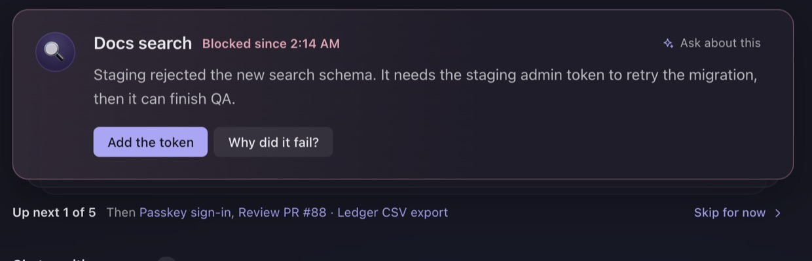

| Part | Spec |
|---|---|
| Position | 26pt below the balloon. |
| Card | Radius 16, padding 22/24/22/22. Two columns: 40pt avatar, 16pt gap, content. Fill: a 95° gradient from the tone at 9% into `rgba(31,29,41,.97)` (by 60%). Border: tone at 32%. Shadow 0 18 40 black 30%. |
| Avatar | First Mate conversation: its emoji disc. PR or review: a pull-request tile (signal for "ready", brand blue for requests). Machine: a disk or device tile in alert. Watcher: its critter. |
| Title row | Title 17pt semibold, then the reason in its tone at 12.5pt semibold (e.g. "Blocked since 2:14 AM"). At the far right: **Ask about this**, a 24pt row with a 13pt accent sparkle and 12pt `--ink-2` label, radius 7, white 6% fill on hover. |
| Body | 6pt below, 15pt/1.65 `--prose`, max width 700pt, with chips. |
| Actions | 16pt below, 6pt apart, 30pt tall, 14pt horizontal padding, 13pt. Primary: accent fill with dark text. Secondary: white 8% fill. Quick replies are pills (accent-wash fill, accent-line border, `#C4C1FA` text), with a ghost "Something else…" pill that opens the conversation. |
| Stack behind | One or two "next" layers peek out under the card: radius 16, white 10% border, fill `rgba(40,38,52,.6)`. Layer 1 sits 10pt lower at 96.5% scale and 75% opacity; layer 2 sits 20pt lower at 93% and 45%. The space below the stack grows by 10 or 20pt to match. |
| Stack navigation | 18pt below, 12.5pt `--ink-2`. "**Up next 1 of 5**" (semibold `--ink`), then "Then" and the next two titles as accent links, then "**Skip for now ›**" right-aligned (ghost accent button). With one card it reads "Just this one" and Skip is hidden. With ideas it reads "Idea 1 of 3". |
| Done | When the last card is answered: a card with radius 14, padding 16/18, signal 6% fill and signal 24% border. It holds a 22pt check-circle, "Nice. You're clear." (14pt semibold) and a next idea (13pt `--prose`). In All clear it reads "All set." |

Card tones:

| Card | Tone | Example reason |
|---|---|---|
| A First Mate is blocked | Alert | "Blocked since 2:14 AM" |
| A First Mate needs your call | Attention | "Your call" |
| A PR is ready for your review | Signal | "Ready for review" |
| Someone requested your review | Attention | "Requested by mk" |
| A machine has a problem | Alert | "Disk full · 1 GB left" |
| An idea (All clear) | Accent | "Ready since yesterday" |

## 8. Chats waiting on you, and While you were away

| Part | Spec |
|---|---|
| Heading | 30pt below the stack. 13.5pt semibold `--ink` plus a count pill (18pt tall, radius 9, white 10% fill, 11pt semibold `--ink-2`). The title changes with the moment: "Chats waiting on you", "Worth a look", "Pick up where you left off". The section is hidden when empty. |
| Grid | Cards fill columns at least 290pt wide, 10pt apart (two across at full width). |
| Chat card | Radius 14, padding 14/16, white 3.5% fill, white 7% border (white 10% on hover). |
| Card content | Row 1: a 9pt dot in the chat's tab color, then the title (13.5pt semibold). Row 2, indented 17pt: the reason (11.5pt; attention semibold when waiting on you) · "workspace on Machine". Quote: the chat's last question, 13pt/1.55 `--prose`, with a 2pt white 12% rule on the left. Quick replies: 26pt pills at 12pt. |
| While you were away | 26pt below. A folded row: radius 12, white 7% border, white 2.5% fill. A 15pt clock, the title (13pt semibold), "7 updates" (`--ink-2`), and a chevron at the right that flips when open. Open: rows of time (11.5pt tabular `--ink-2`, 64pt column) · 13pt icon in its tone · text (12.5pt/1.95 with chips). The title changes with the moment: "While you were away", "Since this morning", "Today", "In the last hour". |

## 9. Ask First Mate and the chat

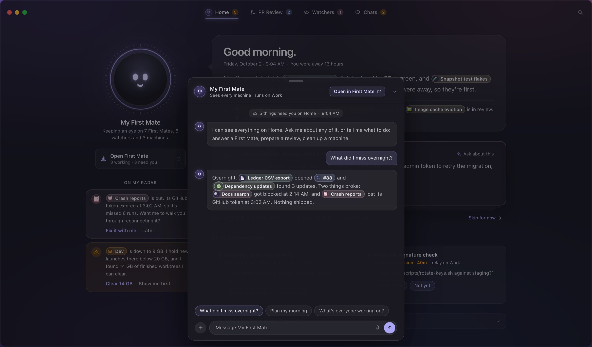

| Part | Spec |
|---|---|
| Ask bar | Floats at the bottom centre of Home, 22pt up. 448×50pt (narrower windows: window width minus 64). Radius 25. Fill `rgba(32,30,41,.92)` with 20pt blur, white 15% border, shadow 0 16 40 black 45%. Contents: First Mate's face at 26pt (current mood), "Ask First Mate…" at 13.5pt `--ink-2`, and a ⌘J key cap. Hover: accent-line border and `--ink` text. Hidden while the chat is open. |
| Opening | Click the bar or the face, press ⌘J, or use "Ask about this" on a card. |
| Scrim | Home dims under `rgba(10,10,14,.42)`, fading in over 0.2s. Clicking it closes the chat. |
| Chat | Anchored 16pt from the bottom, centred. **574pt wide** (window width minus 48 when narrower); height 78% of the window, at most 700pt. Radius 18, fill `rgba(27,26,34,.98)`, white 15% border, shadow 0 30 80 black 60%. Rises 24pt and fades in over 0.26s on an ease-out curve (cubic-bezier .2, .8, .2, 1). |
| Grab handle | 38×4pt, radius 2, white 20%, centred 7pt from the top. |
| Header | Padding 20/12/12/16 with a hairline below. First Mate's face at 30pt; "My First Mate" (14pt semibold) over "Sees every machine · runs on Work" (11.5pt `--ink-2`; "Thinking…" while answering). Right side: **Open in First Mate ↗** (26pt pill, radius 7, accent-wash fill, accent-line border, 12pt semibold `#CFCCFA`) and a chevron-down that minimizes back to the bar. |
| Body | Padding 16/18, 12pt between messages. It starts with a centred context pill (white 5% fill, radius 10, 11.5pt: home icon, "5 things need you on Home · 9:04 AM") and First Mate's opener. |
| Messages | First Mate: its face at 24pt plus a bubble (white 5.5% fill, white 7% border, radius 5/14/14/14, padding 10/13, 13.5pt/1.6 `--prose`, chips inline). You: right-aligned, max 85% wide, accent 16% fill, accent 24% border, radius 14/14/5/14, `--ink`. Typing: three dots pulsing. |
| Suggestions | Above the composer, 6pt apart: 28pt pills, radius 14, white 4% fill, white 10% border, 12.5pt `--ink-2`. Hover: accent. They change with the moment. |
| Composer | A 30pt round "+" (white 8%), a 38pt field (radius 19, white 6% fill, white 10% border, accent border when focused) with a microphone, and a 30pt round accent send button with an up arrow. |
| Moving to the window | "Open in First Mate" closes the chat and opens the First Mate window on My First Mate. The conversation comes with you, under a "From Home" summary card. |
| Closing | Esc, the chevron, or clicking the scrim. Anything First Mate said stays in the conversation. |

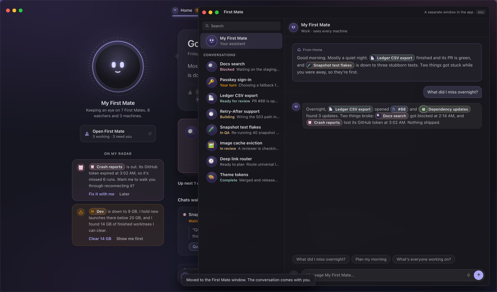

*The First Mate window is the existing design and isn't redesigned here.*

## 10. Smart chips and where things go

Chips are inline pills inside First Mate's sentences: 21pt tall, radius 11, 12pt semibold `--ink`. A 17pt leading avatar sits at 2pt left padding, with 8pt right padding. Fill: tone at 11% over white 6%. Border: tone at 36%. Hover: tone at 22% with the full-tone border. Long names cut off at 220pt.

| Chip | Leading | Tone | Opens |
|---|---|---|---|
| First Mate conversation | Its emoji disc | Its status: Blocked alert, Your turn attention, Ready signal, Working `#E4C386`, Ready to plan `#8E8E96` | The First Mate window on that conversation |
| Watcher | Its critter | Its avatar tone; alert when it needs a look | Watchers tab, with that watcher highlighted |
| Pull request or review | Pull-request icon | Brand blue; alert when it couldn't be prepared | PR Review tab, with that PR highlighted |
| Chat | A dot in the chat's tab color | The tab color | That chat |
| Machine | Its device icon | `--ink-2`; attention when low on disk; alert when offline or full | Settings › Machines |

**Linked screens.** PR Review, Watchers and Chats are the existing screens and aren't redesigned here; the reference page only sketches them. They start 86pt from the top so they clear the strip. Arriving from a chip highlights the item (accent-line border plus a 3pt accent glow at 16%) and scrolls it to the centre.

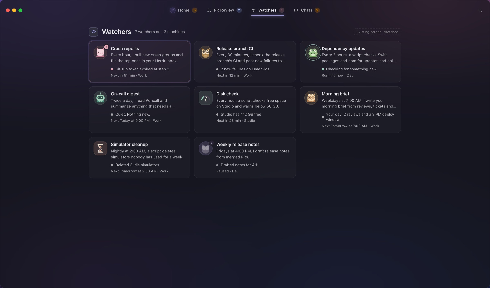

## 11. Moments

Home changes with your day. The four moments in the reference cover the main cases.

| | Morning | Afternoon | All clear | Something broke |
|---|---|---|---|---|
| Greeting | Good morning. | Good afternoon. | Good evening. | Heads up. |
| Face | Attentive | Calm | Happy (green ring) | Concerned (rose ring) |
| Focus title | Start with these (5) | Waiting on you (1) | If you have a minute (ideas) | Fix these first |
| Chats title | Chats waiting on you | Worth a look | Pick up where you left off | Chats waiting on you |
| Radar | A watcher is out; a disk is low | First Mate passed CI failures along; a PR merged | Good week | A watcher keeps failing; a review couldn't be prepared |
| Recap | While you were away | Since this morning | Today | In the last hour |
| Suggestions | What did I miss overnight? · Plan my morning · What's everyone working on? | What changed since this morning? · Anything to check before the deploy? · Start something new | Wrap up my week · What runs over the weekend? · Start something new | What happened? · Is anything lost? · Fix what you can |

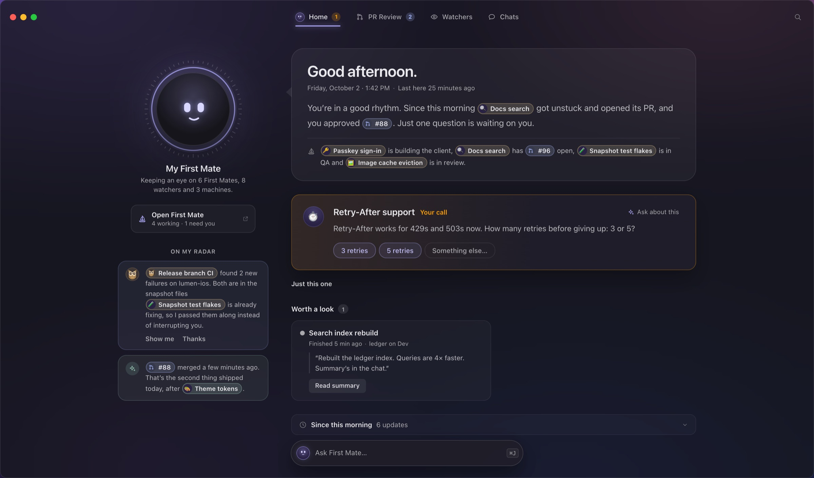
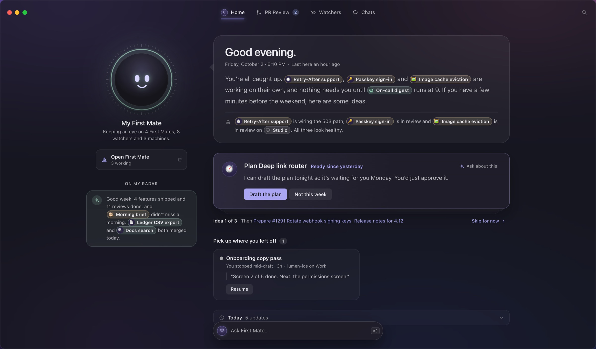
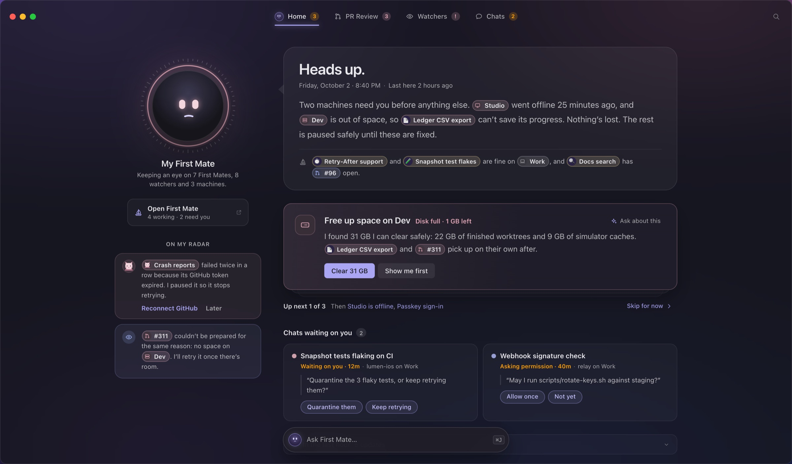

Empty and edge states:

- **Nothing in a section:** the section is hidden (chats, radar).
- **One focus card:** "Just this one", with no Skip.
- **Cleared everything:** the done card, and the face turns happy.
- **All clear:** the focus cards become ideas, and the Home tab shows no count.
- **Machine trouble:** machine fixes always come first, and the face stays concerned until they're handled.

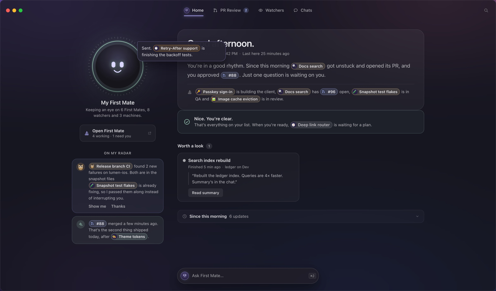

## 12. Interactions

| Action | Result |
|---|---|
| Answer a card (quick reply or primary button) | The card slides 16pt right and fades over 0.24s. The next card moves up, and First Mate confirms in the reply bubble ("Sent. Passkey sign-in is back to building the client."). |
| "Later" / "Not this week" | The card leaves the same way; First Mate says when it'll bring it back. |
| Skip for now | The next card comes to the front; the skipped one goes to the back of the stack. |
| "Then …" links | Jump straight to that card. |
| Ask about this | Opens the chat and asks about that card. |
| Click the face or the Ask bar, or press ⌘J | Opens the chat. |
| Open First Mate, or a First Mate chip | Opens the First Mate window. |
| Tabs, ⌘1–⌘4 | Switch places. Home remembers its state. |
| Esc | Closes whichever is open, in this order: search, the First Mate window, the chat. |
| First open of a moment | Blocks fade up 8pt in sequence, 120ms apart (greeting first; the summary sentences fade one after another). Later visits don't animate. |

Reduce Motion turns off the entrance, the floating, the tick rotation, the thinking arcs, the talking mouth, the pointer-following eyes and the slide-outs. States still change instantly.

## 13. First Mate's voice

- First person, plain and short. Lead with what changed, then what needs you.
- Name things with chips, not counts ("Ledger CSV export finished and its PR is green").
- The summary is two or three sentences. Radar notes are one or two sentences plus an offer ("Want me to walk you through reconnecting it?", "I found 14 GB of finished worktrees I can clear.").
- Calm in trouble: "Heads up." and "Nothing's lost. The rest is paused safely until these are fixed."
- When it handles something itself, say so: "Both are in the snapshot files Snapshot test flakes is already fixing, so I passed them along instead of interrupting you."
- When quiet, suggest: "If you have a few minutes before the weekend, here are some ideas."

## 14. Tokens used

| Token | Value | Use |
|---|---|---|
| Ink | `#E9E9EC` | Titles, current tab |
| Prose | `#BABABE` | Body text |
| Ink 2 | `#A9A9AD` | Secondary text, resting tabs |
| Icon | `#7F7F83` | Quiet icons |
| Accent | `#AAA6F4` | Current tab underline, links, primary buttons, First Mate glow |
| Accent wash / line | accent at 10% / 38% | Pills, hovers, borders |
| Attention | `#FF9F0A` | Needs you |
| Alert | `#E2A7B6` | Blocked, failing, offline, full |
| Signal | `#9CCDB9` | Ready, done, happy |
| Working | `#E4C386` | Building |
| Idle | `#8E8E96` | Ready to plan |
| Brand blue | `#A6BAFF` | PRs, reviews, info notes |
| Eye | `#D9D6FF` | First Mate's eyes and mouth |
| Disc | `#2A2244` | Emoji discs |
| White fills | white at 3, 4, 5, 6, 8, 10, 12, 15, 20% | Surfaces, hairlines (7%) and borders (10%) |

Type: SF Pro Text for UI and SF Pro Display for the greeting and name. Sizes used: 30 (greeting), 17 (name, card title), 16.5 (summary), 15 (card body), 13.5 (chat text, section titles), 13 (tabs, buttons, chat card titles), 12.5, 12, 11.5, 11 and 10.5 (counts).

Radii: 25 (Ask bar), 24 (balloon), 18 (chat), 16 (focus card, radar notes), 14 (chat cards, done card), 12 (window, First Mate button, recap), 10 (tabs), 9 (search icon, counts), 7 (small pills).

## 15. Not covered

- Light mode (Herdr Mac is dark only).
- Windows narrower than about 1,100pt.
- VoiceOver wording and focus order.
- First run (see the onboarding study).
- The PR Review, Watchers and Chats screens themselves, and the First Mate window.

The design assumes First Mate can supply, for each moment:

- the written summary
- what happened while you were away, with times
- a reason for each chat
- offers to act

What happens when one of those is missing is open.

## Files

| File | What |
|---|---|
| `reference.html` | The locked design, interactive. `?m=morning\|afternoon\|clear\|trouble` picks the moment. |
| `first-mate-home.css` | All styles the reference renders, in one file. Pruned with Chrome CSS coverage, then compared state by state against the chosen take. |
| `first-mate-home.js` | Builds every part and its states. |
| `moments.js`, `data.js` | First Mate's copy for each moment, and the synthetic world (First Mates, watchers, chats, machines, reviews). |
| `assets/watchers/` | The watcher avatars the app ships. |
| `previews/` | Screenshots used in this spec (`pins.json` places the numbered pins). |
| `index.html` | This spec as a page. |

History: chosen on October 3, 2026 from the First Mate Home study, round 2c, take 6 (toolbar tab style, First Mate button under the face). The study is in `design/dashboard-redesign-2026-10-02/home/`.
