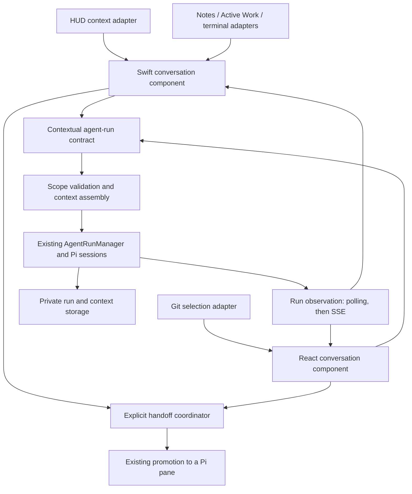

# Contextual assistant architecture

Status: Initial implementation, 2026-09-07.

The Git, Mac HUD, and Notes entry points now use reusable contextual conversation
components over a versioned agent-run profile. This initial delivery implements
supplied-context-only questions (`--no-tools`), frozen context, explicit refresh,
request deduplication, strict continuation, history retrieval, local persistence,
and explicit promotion. Legacy HUD action conversations remain separate.

The sections below retain the broader architectural direction. Scoped read/search
tools, automatic context-reference resolution, model-aware context budgeting,
shared Swift package/iOS adoption, cross-device history synchronization, and SSE
are follow-up work. Native context can be added as pasted text; existing HUD
image/voice attachment controls remain in its action conversation. The question
handoff opens an agent with history; the user enters the action request there.

Question runs use the server's existing rolling retention. Client history stays
local until a new question clears it; server request-ID tombstones prevent replay
after expiry. The initial implementation uses fixed byte limits and rejects
oversized context instead of silently truncating it.

Reviewed against revision `ce9a3d0` on 2026-09-07.

## Product decision

Make a contextual question assistant easy to present from any Herdr feature.
The presenting feature supplies its location, selected content, and relevant
additional context. The shared assistant owns the conversation, context preview,
model selection, progress, recovery, and handoff.

**Confirmed direction:** Answer questions here. Use an explicit **Continue in
agent** handoff for actions. Do not infer permission to act from selected text,
feature context, or an assistant response.

Start with the Mac HUD and the existing embedded Git selection experience.
Design the contract for native iOS and additional features, without requiring a
standalone web redesign or rewriting the full Pi conversation UI.

## Existing foundation

| Area | Current implementation | Architectural consequence |
| --- | --- | --- |
| Execution | [`AgentRunManager`](../herdr_harness/agent_runs.py) runs Pi, stores private run/session files, bounds concurrency, handles cancellation, continuation, expiry, and promotion. | Reuse this engine and provider configuration. No new model gateway or agent framework. |
| Git questions | [`InlineAskPanel`](../frontend/herdr-web/src/components/Git/InlineAskPanel.tsx) owns local turns and polls every 900 ms. [`selectionAsk.ts`](../frontend/herdr-web/src/components/Git/selectionAsk.ts) formats the first prompt and truncates selected code at 6,000 characters. | Extract conversation state and rendering from Git. Keep DOM selection capture in Git. |
| Mac HUD | [`HerdrHudSession`](../herdr-harness-mac/herdr-harness-mac/State/HerdrHudSession.swift) owns history, attachments, preferences, audio, persistence, and a continuation pointer. It currently submits in `act` mode. | Separate the reusable question conversation from HUD window, audio, notification, and existing action behavior. |
| Native transport | [`HeadlessAgentController`](../herdr-harness-mac/herdr-harness-mac/State/HeadlessAgentController.swift) handles one run with polling and depends directly on `HerdrAppModel`. | Put an injected transport boundary between conversation state and the application model. |
| Scope | [`start_agent_run`](../herdr_harness/service.py) resolves optional `paneId` to a working directory and adds a bounded topology snapshot. | Add explicit structured scope and context. A working directory alone does not identify the selected view or content. |
| Continuation | Existing roots own append-only Pi sessions. A missing continuation can fall back to a new root; a valid continuation inherits the root working directory. | Contextual requests need strict scope/continuation semantics and visible expiry. |
| Git presentation | [`PaneGitWebContainer`](../herdr-harness-mac/herdr-harness-mac/Views/Pane/PaneGitWebContainer.swift) embeds the web Git view in WKWebView. iOS has a separate native Git view. | Share a wire contract and behavior across Swift and React; keep two small renderers. No new native/web bridge is needed initially. |
| Events | [`EventBroker`](../herdr_harness/events.py) supports bounded SSE replay. Agent runs currently persist message-end responses and tool steps for polling. | Poll first behind an observation abstraction. Real token streaming needs additional backend work. |

## Architecture



The reusable unit is a **conversation component with injected context and
transport**. It is not a global singleton chat. Each independent question thread
has its own identity and context; multiple presentations can deliberately observe
the same thread without duplicating execution.

### Ownership boundaries

| Layer | Owns | Integration surface |
| --- | --- | --- |
| Presenting feature | Semantic location, selection capture, extra context, suggested questions, local presentation anchor | `AssistantLaunch` and feature context adapter |
| Conversation session | Draft, turns, active run, pinned scope, context revisions, retry/stop/reconnect, unseen result state | `AssistantSession` |
| Reusable UI | Transcript, composer, context chips/details, progress, errors, handoff button | `AssistantConversationView` / `AssistantConversation` |
| Presentation host | Popover, inspector, sheet, HUD window, focus and placement | Presentation configuration; dismiss callback |
| Transport | Authenticated requests to the pinned machine, run observation, model catalog, attachments | `AssistantTransport` |
| Server | Scope validation, context resolution/budgets, session ownership, tool policy, idempotency, persistence, execution | Additive contextual contract over agent runs |

Use a `@MainActor @Observable` native session with injected dependencies. Views
receive bindings and actions, rather than looking through `HerdrAppModel` for
arbitrary state. Keep request/context DTOs immutable and `Sendable`. File reads,
network work, and persistence stay outside view rendering.

Initially put the native component in a dedicated Assistant feature folder in the
Mac target. Extract platform-neutral DTOs, transport, and session logic into a
local Swift package when adding the iOS consumer. This avoids copying another
large state model into iOS without making package restructuring a prerequisite.
React uses a session store outside the mounted panel and a small view over it.
Swift and TypeScript share JSON fixtures and lifecycle expectations, not source.

## Context contract

All names and fields below are proposed. Separate three concepts:

1. **Execution scope:** machine connection, workspace/pane identity, validated
   repository root. Determines where reads and eventual handoff are allowed.
2. **Semantic location:** feature, document/item identity, file and diff side,
   line/character ranges, revision. Explains what the user means by “this.”
3. **Presentation anchor:** screen rectangle, popover alignment, focus return
   target. Stays in the client and is never sent to the model.

`AssistantLaunch` contains a scope, semantic location, initial context items,
optional question/draft, suggested questions, presentation style, and optionally
an existing conversation handle. Supplying an initial draft does not auto-send.
Opening the component does not make an inference request.

| Context value | Proposed fields and rules |
| --- | --- |
| Envelope | `version`, `snapshotId`, `capturedAt`, `source`, `items` |
| Source | `feature`, `instanceId`, semantic resource identity; optional structured selection position |
| Scope | Client machine connection plus server-validated workspace/pane and optional `expectedRootPath`; execution destination is not selectable through context text |
| Item | `id`, versioned `kind`, `label`, `priority`, `capturedAt`, typed `locator`, revision/fingerprint, and a bounded inline body or resolvable resource reference |
| Selection | Exact selected text, file identity, side-specific spans, and available source revision; surrounding excerpt is a separate item |
| Additional context | Typed file excerpts, note/item references, terminal excerpts, user attachments, or a bounded plain-text item |
| Resolved manifest | Included item IDs, revisions, sizes, omitted/truncated items and reasons, actual scope, snapshot ID |

Keep stable locator fields typed. Add new feature kinds through a registered
resolver with schema validation and a plain-text fallback where appropriate.
Do not accept arbitrary serialized view models, executable callbacks, or
feature-controlled system instructions in the wire payload. A server resolver
may resolve a known resource ID; it must not fetch arbitrary URLs or paths from
an opaque context object.

For Git, preserve staged/unstaged/untracked section, old and new paths for
renames, base/head blob IDs where available, and a content fingerprint for mutable
index/worktree content. A selection crossing removed and added lines needs
multiple side-specific spans, not one min/max range. Treat the displayed excerpt
as the source of truth for the question even if the checkout subsequently changes.
Keep exact whitespace; prepare display summaries separately. Unknown positions
stay unknown rather than being inferred from text.

### Capture and freshness

- Capture the initial selection and semantic location when the user invokes
  Ask. Switching focus to the assistant must not erase the original selection.
- Pin machine, repository scope, and origin to the conversation. Navigating to
  another workspace does not silently redirect the next turn.
- Follow-ups use pinned context. “Add current selection” and “Refresh context”
  create a new immutable context snapshot for the next turn, visibly recorded in
  the transcript. A scope change starts a new conversation.
- Resolve resource references at submission and freeze the resolved content before
  launching the run. Save both the manifest and resolved bytes, so retry does not
  unknowingly use different context.
- If a reference changed, distinguish the captured excerpt from any fresh reads.
  Reject a missing/changed execution root with a recoverable scope error. Never
  fall back to the machine home directory for a scoped question.
- Removing context before the first send prevents inclusion. After a send,
  removing an item only prevents future inclusion; the existing Pi session still
  knows earlier turns. Offer a new conversation when the user wants a clean context.

The user sees a compact row such as **Git · Example.swift · added lines 42–57**,
with expandable context details and removable optional items. HUD launches show
the captured Herdr feature when one is available, otherwise the selected machine
and an explicit “No feature context” state. Do not automatically capture other
applications, screens, clipboard contents, or unrelated pane transcripts.

### Assembly and budgets

The server assembles one consistent model input: server question policy,
user question, marked untrusted context items, and relevant scoped topology.
User preferences can supplement the question policy but cannot replace its tool
boundary. Existing HUD action prompt overrides remain part of the legacy action
flow until explicitly migrated.

Proposed starting defaults: 64 KiB total resolved text context and 16 KiB per
text item, configurable privately. Also reserve space for conversation history,
instructions, and output against the selected model's available context window.
Byte limits are validation limits, not token estimates. Keep existing attachment
count/size and vision-model validation as a separate budget.

Prioritize user-selected content and user attachments, then nearby feature
context, then ambient summaries. Deduplicate by resource/revision/content hash.
Never silently trim the user's question or required selection. If required
content cannot fit, ask the user to narrow it or deliberately attach it as a file.
Optional omissions appear in the manifest and UI. Do not send the entire fleet
snapshot for a file-specific question; machine-wide questions can opt into a
bounded topology item.

## Backend and API changes

Keep `/api/v1/agent-runs`, existing Pi sessions, model discovery, attachment and
promotion machinery. Add a contextual profile rather than a second execution
service or a new database up front.

Proposed new discovery endpoint: `GET /api/v1/agent-runs/capabilities`, advertised
in API discovery, describing contextual schema versions, strict continuation,
question tool profile, idempotency, history retrieval, observation modes, and
limits. A 404 means legacy capabilities. Each client negotiates per machine.

Illustrative new-client request:

```json
{
  "prompt": "Why does this branch return early?",
  "mode": "ask",
  "profile": "contextual-question-v1",
  "clientRequestId": "2f55fa70-df1c-4f6c-ab47-9dce40407ea9",
  "paneId": "pane-example",
  "scope": { "expectedRootPath": "/work/example-project" },
  "context": {
    "version": 1,
    "snapshotId": "ctx-example",
    "capturedAt": "2026-09-07T12:00:00Z",
    "source": { "feature": "git.diff", "instanceId": "diff-example" },
    "items": [{
      "id": "selection-example",
      "kind": "text-selection.v1",
      "label": "Example.swift, added line 42",
      "priority": "required",
      "locator": {
        "path": "Sources/Example.swift",
        "section": "unstaged",
        "spans": [{ "side": "new", "startLine": 42, "endLine": 42 }]
      },
      "text": "guard isReady else { return }"
    }]
  }
}
```

The authenticated connection selects the machine. The server resolves the pane
and compares its canonical root with the expected root. Add validated workspace
scope for future surfaces that have no pane; genuinely machine-wide HUD questions
use an explicit machine scope and a correspondingly limited context/tool set.

For contextual requests:

- Persist `clientRequestId`, request hash, origin, validated scope, context manifest,
  profile, parent run ID, and root conversation metadata alongside current run
  files. Keep writes atomic/private and use the existing rolling expiry as the
  initial retention policy (currently 24 hours by default).
- Return the same run for the same authenticated server/request ID and identical
  payload. Reject reuse with a different payload. Claim the ID durably before
  spawning Pi. A timeout after POST is an unknown submission outcome, so clients
  reconcile with the same key instead of starting another run.
- Use the existing `threadRootRunId` as the server conversation identity. Client
  handles include the machine ID. Avoid a second independent conversation ID.
- Extend follow-ups with `continueFromRunId` and an expected latest run ID. Under
  a root-scoped lock, validate scope/profile, reject concurrent or stale appends,
  and serialize writes into the Pi session. Global execution concurrency limits
  alone do not provide conversation ordering.
- Require valid continuation. Return typed errors for expired, missing, promoted,
  scope-mismatched, busy, or stale conversations. Do not silently start a fresh
  question session. Keep legacy fallback semantics for unprofiled clients.
- Add authenticated `GET /api/v1/agent-runs/{rootRunId}/turns` with bounded
  pagination, ordered history, active/latest run, context summaries, and expiry.
  Add a run-specific context details endpoint if the summary is insufficient.
  Return user-facing context data, never internal session paths or credentials.
- Recover interrupted runs as terminal on restart and retain enough request-ID
  metadata to prevent duplicate execution. Promotion, append, cancellation, and
  expiry must coordinate through the same root ownership rules.

Keep this storage inside the existing private agent-run store. Introduce an index
or SQLite only if measured history/idempotency lookup cost requires it. Migration
must tolerate older records without new fields and older servers ignoring new
stored metadata, without reinterpreting a contextual run as a legacy action run.

### Enforce question-only behavior

Current `ask` mode removes `write` and `edit` but still exposes `bash`; its
investigative-only charter is not an execution boundary. The contextual profile
must expose only context inspection and validated read/search tools. No general
shell, file writes, pane control, or outbound action tools.

First validate the explicit Pi extension/tool mechanism against the installed
supported version using synthetic fixtures. Implement narrow tools for bounded
file reads/search and specific Git inspections, with canonical-root and symlink
checks. Do not use a shell command allowlist as a substitute for scoped tools.
The model receives an excerpt or resource handle, not arbitrary machine access.
If scoped tools are unavailable, advertise a supplied-context-only profile and
omit tool access, or leave the feature unavailable. Never silently fall back to
legacy shell-enabled Ask while labeling it question-only.

Provider credentials continue through the existing private Pi/provider setup.
Feature context is data, including code comments and note text that look like
instructions. Reject context-supplied privileges and machine destinations at the
server boundary.

## Conversation and presentation behavior

| Event | Shared behavior |
| --- | --- |
| Open | Create or resume a scoped draft without an inference request. Restore focus to its source when dismissed. |
| Send | Freeze context, retain draft/attachments until accepted, create one request ID, enter submitting then queued/running. |
| Dismiss | Detach the view. The app-owned session continues and remains available through its host or recent questions entry. |
| Stop | Explicitly cancel execution, reconcile the terminal state, preserve partial response/history. Handle Stop before POST returns. |
| Disconnect | Show reconnecting/unknown outcome. Continue observation on the original machine; do not resend the question automatically. |
| Retry | Reconcile an uncertain submission with its original ID. An explicit retry of a terminal failed turn creates a new attempt with the same frozen input. |
| Scope change | Keep the old thread pinned. Start a new scoped draft or explicitly hand off; never transplant its live Pi session. |
| Expiry | Display retained local transcript if available and explain that live context expired. “Start new question” is explicit. |
| Handoff | Transfer session ownership to the promoted Pi pane and show an Open agent destination; further work happens there. |

Only one observer loop per conversation runs in each client process, regardless
of how many panels display it. UI dismissal cancels only view subscriptions.
Transport and execution states are separate: an HTTP failure does not mean Pi
stopped. Closing the entire app stops local observation; the server's existing
timeout/expiry policies still bound background work.

Initially use polling with backoff/jitter behind `observeRun`. Later add agent
run events to the existing SSE infrastructure with run revision numbers,
reconnect cursors, gap detection, and GET resynchronization. Token deltas need Pi
event decoding and coalesced persistence; do not promise token streaming from the
current message-end implementation. Persisted run state remains authoritative.

Reuse existing markdown, code blocks, model controls, attachments, and artifact
renderers where they can accept presentation data independently. Keep voice
capture/playback, HUD window placement, session chips, and full Pi interaction
cards in their existing feature owners. Support keyboard send/stop, accessible
context labels, selectable replies, and scrolling that respects someone reading
earlier turns rather than always jumping to the bottom.

### Explicit handoff

**Continue in agent** opens a small handoff composer showing the pinned machine,
workspace destination, and editable action request. Clicking its launch control
is the explicit user action to promote the conversation. Merely asking a question
or receiving a suggested fix never promotes it.

Use existing promotion so the agent retains the actual question history and
resolved context. Revalidate the destination against the root scope, wait for or
stop any in-flight question, and reserve the root during promotion. Keep question
and agent ownership mutually exclusive. Submit the optional action request only
after promotion succeeds and the pane is ready, with its own deduplication key.
Promotion is not itself a new action prompt.

On failure, leave the question transcript intact and offer retry. If the live
session expired, explicitly offer a new agent with a visible transcript/context
attachment instead of claiming the original session was preserved.

## Rollout and implementation slices

Dependencies: 1 precedes 2 and 3; 2 and 3 precede the complete Git pilot (4);
4 precedes HUD adoption (5); 6 follows a successful pilot.

| Slice | Deliverable | Acceptance boundary |
| --- | --- | --- |
| 1. Contract and runtime spike | Versioned schemas/fixtures, discovery design, question-tool proof, storage/continuation decisions | Synthetic Pi run answers from supplied context and a permitted scoped read; out-of-scope reads and action tools are unavailable. No production rollout yet. |
| 2. Server foundation | Context resolver/store, contextual profile, idempotency, strict continuation, root serialization, history, promotion ownership | Lost POST response creates one run; changed scope and concurrent appends fail clearly; restart/expiry preserve coherent history and ownership. |
| 3. Reusable clients | Native session/transport boundary, React session store, shared context and conversation UI contracts | Two presentations of one handle share turns and execution. Dismiss/reopen preserves draft and running work. |
| 4. Git vertical slice | Replace InlineAskPanel internals with the reusable component and Git context adapter; wire explicit handoff | Select added/deleted/renamed code, ask and follow up, inspect exact context, change file, dismiss/reopen, then hand off without changing repositories. Test in WKWebView and the retained web Git surface. |
| 5. HUD adoption | Add contextual Ask entry using captured Herdr location; extract shared conversation/attachments/model plumbing | Existing HUD action history, preferences, voice, notifications, and promotion still work. Ask has a visibly separate scoped conversation and question-only tools. |
| 6. Prove reuse | Add one non-Git native adapter, preferably a note, then iOS adoption and optional SSE | The new feature supplies an adapter/launcher only. It adds no new run loop, prompt template, transcript store, or model-routing implementation. |

For HUD migration, keep existing persisted action threads identified as legacy
action threads. Do not append questions to those sessions or silently downgrade
their behavior. An explicit Ask entry gets the new component; existing action
controls remain available. Deciding whether Ask eventually becomes the default
HUD experience is a later product decision.

Deploy the server first with additive capabilities, then gate clients per
machine. Old clients continue using their existing payloads and semantics. New
clients never send unknown fields to old servers, whose current POST validator
rejects them. Keep current legacy surfaces available during rollout; disable
unsupported new contextual features with an explanation. Rollback switches off
the new entry points while preserving stored transcripts and original HUD files.

The standalone web roadmap remains unchanged. Its Git dependency needs these
changes for the Mac app, regardless of the browser product's eventual direction.

## Verification and completion criteria

Use entirely synthetic contexts, repositories, attachments, and screenshots.

- Contract tests in Python, Swift, and TypeScript cover schema versions, unknown
  optional fields/kinds, size budgets, omissions, scope IDs, and old/new versions.
- Context tests cover mixed diff sides, partial-line whitespace, renames, staged
  versus worktree revisions, deleted files, stale references, and symlink escapes.
- Lifecycle tests cover stop-before-acceptance, lost POST response, retry,
  dismiss/reopen, two views, two clients appending, machine switches, server
  restart, expiry during handoff, and promotion versus append races.
- Tool tests prove that hostile selected text cannot activate action tools or read
  outside scope. Verify the emitted Pi tool configuration and actual tool behavior.
- Migration tests retain existing HUD history/attachments/model preferences and
  legacy agent-run behavior. Full Pi chat transport remains independently tested.
- UI verification covers Git selection and its anchor in WKWebView, context
  inspection, keyboard/VoiceOver, preserved scroll position, HUD focus capture,
  and an explicit handoff that opens the intended agent pane.

Run the applicable Python, web, Pi extension, native unit/build and demo UI checks
from the root README for each implementation slice. Run
`scripts/check-public-source.py` before committing. No implementation tests are
required for this planning document itself.

Track content-free measurements: source feature, time to first visible progress
and answer, context bytes/omissions, reconnect and continuation failures, duplicate
request suppression, and successful handoffs. Do not log selected text, prompts,
file paths, credentials, or transcripts as telemetry.

The improvement is complete when Git, contextual HUD Ask, and one additional
feature can each provide a small context adapter and presentation host while the
same conversation behavior handles history, execution, recovery, and handoff.

## Deferred decisions

- Whether contextual Ask becomes the default HUD interaction after the pilot.
- Retention beyond the current rolling server expiry, pinned questions, and
  cross-device discovery of recent questions. Client reopen within the initial
  retention window is in scope; indefinite archival is not.
- Whether a native Git assistant presentation eventually merits a WKWebView
  bridge. The initial React component inside embedded Git needs no bridge.
- SSE/token streaming priority after measuring polling and response latency.
- Additional context resolvers, remote research tools, and richer handoff targets.
  None is required to prove the initial reusable component.
